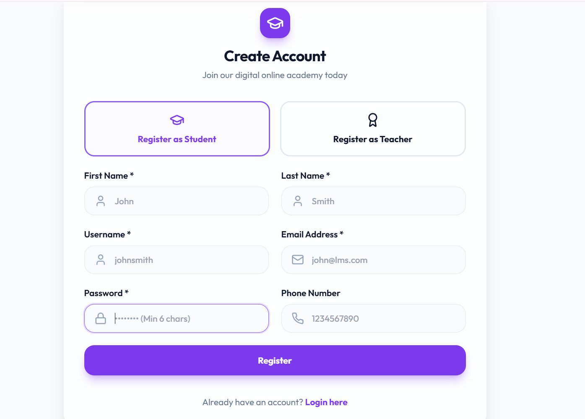
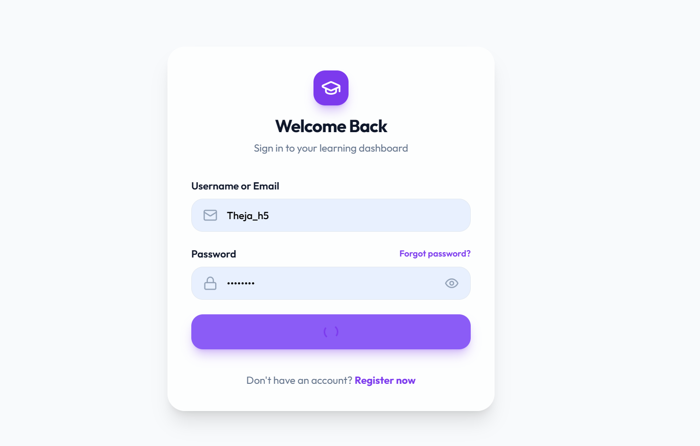
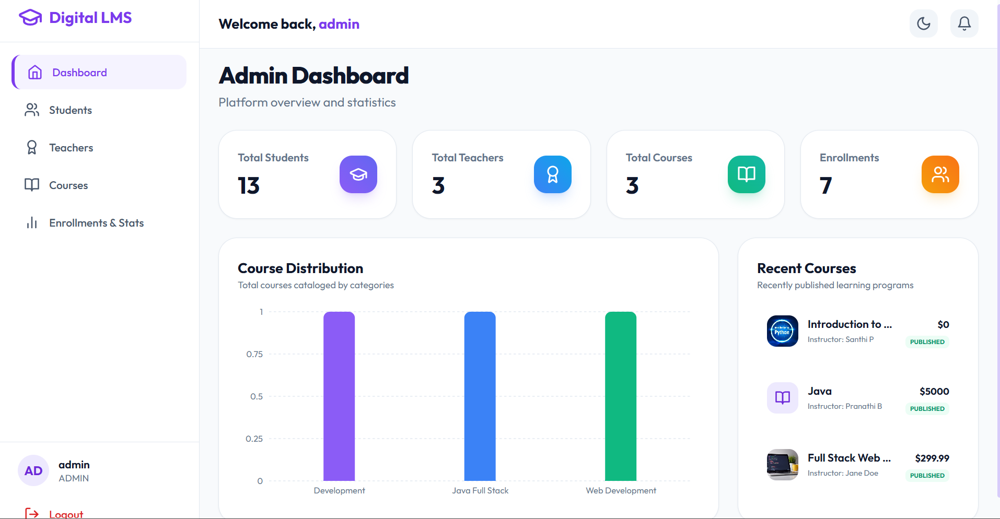
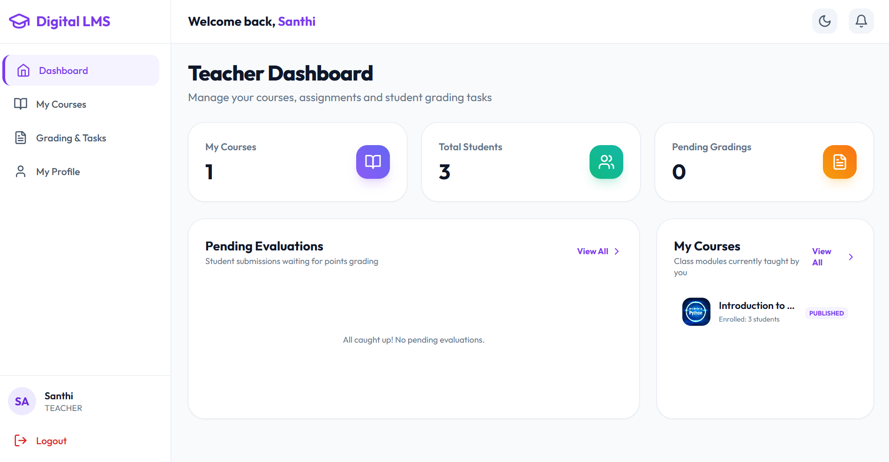
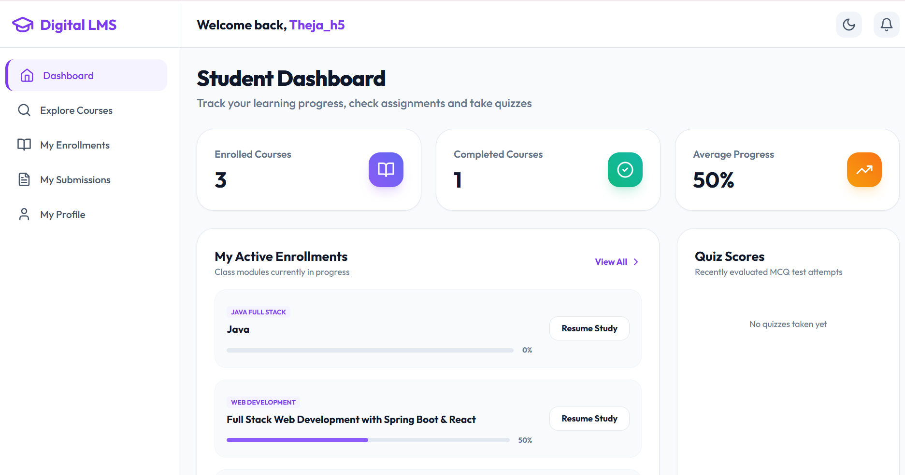
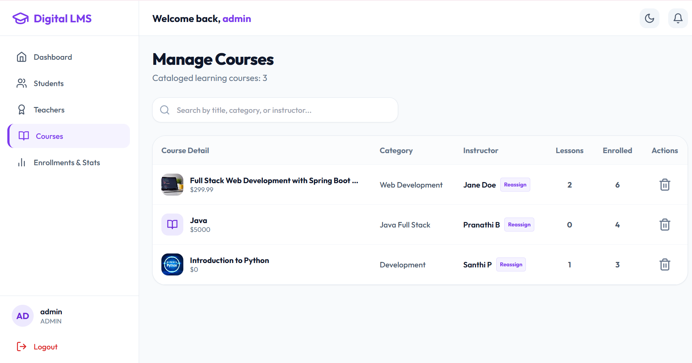
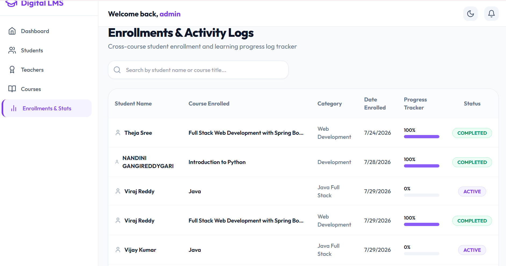

## 🎓 Digital Learning Management System (DLMS)

## 📖 Overview

Digital Learning Management System (DLMS) is a full-stack web application designed to provide a centralized platform for online learning. It supports **Admin, Teacher, and Student** roles with secure authentication, course management, assignments, quizzes, and progress tracking.

## 🌐 Live Demo

- **Frontend:** [Digital Learning Management System](https://digital-lms.netlify.app/login)
- **Backend:** [Spring Boot API](https://digital-learning-management-system.onrender.com)

## 🚀 Features

- 🔐 Secure Login and Registration
- 👨‍💼 Admin Dashboard
- 👨‍🏫 Teacher Dashboard
- 👨‍🎓 Student Dashboard
- 📚 Course Management
- 🎥 Lesson and Learning Material Management
- 📝 Assignments and Submissions
- 🧠 MCQ Quizzes with Timer
- 📊 Student Progress Tracking
- 🔑 JWT-Based Authentication
- 👥 Role-Based Access Control

 ## 🛠️ Technologies Used

 ## Frontend
- React.js
- JavaScript
- HTML
- Tailwind CSS
- Axios

##  Backend
- Java
- Spring Boot
- Spring Security
- Spring Data JPA
- Hibernate
- REST APIs
- JWT

##  Database
- MySQL

 Deployment
- GitHub
- Render
- Netlify

##  📂 Project Structure

Digital_Learning_Management_System/
│
├── backend/
│   ├── src/
│   └── pom.xml
│
├── frontend/
│   ├── src/
│   ├── package.json
│   └── vite.config.js
│
├── screenshots/
│   ├── login.png
│   ├── admin-dashboard.png
│   ├── teacher-dashboard.png
│   └── student-dashboard.png
│
└── README.md
## 📸 Project Screenshots

## 📝 Registration Page


## 🔐 Login Page


## 👨‍💼 Admin Dashboard


## 👨‍🏫 Teacher Dashboard


## 👨‍🎓 Student Dashboard


## 📚 Course Management


## 📊 Progress Tracking


## ⚙️ Application Workflow

1. Users register and log in to the system.
2. JWT authentication verifies the user's identity.
3. Based on the user's role, the system provides access to the appropriate dashboard.
4. Teachers can create courses, lessons, assignments, and quizzes.
5. Students can enroll in courses, access learning materials, submit assignments, and attempt quizzes.
6. Administrators can manage users, courses, and teacher assignments.
7. Student activities and completed lessons are used to track learning progress.

## 🔐 Security

The application implements secure authentication and authorization using:

- JWT-based authentication
- BCrypt password hashing
- Role-based access control
- Protected REST API endpoints
- Separate permissions for Admin, Teacher, and Student

## 🚀 Deployment

The application is deployed using separate frontend and backend services.

- **Frontend:** Netlify
- **Backend:** Render
- **Database:** MySQL
- **Source Code:** GitHub

The frontend communicates with the Spring Boot backend through REST APIs.

## 💻 Local Development

### Prerequisites

Make sure the following are installed on your system:

- Java 21
- Maven
- Node.js
- npm
- MySQL

### Setup and Run

Clone the repository:

```bash
git clone https://github.com/Nandini-Reddy-05/Digital_Learning_Management_System.git
cd Digital_Learning_Management_System
```

### Database Configuration

Create the MySQL database:

```sql
CREATE DATABASE dlms_db;
```

Configure the database connection in:

```text
backend/src/main/resources/application.properties
```

Update the required MySQL credentials:

```properties
spring.datasource.username=root
spring.datasource.password=YOUR_PASSWORD
```

> Do not commit database passwords, JWT secrets, or other sensitive credentials to GitHub.

### Backend

Navigate to the backend directory:

```bash
cd backend
mvn spring-boot:run
```

The Spring Boot backend will be available at:

```text
http://localhost:8080
```

### Frontend

Open a new terminal and navigate to the frontend directory:

```bash
cd frontend
npm install
npm run dev
```

The frontend will be available at:

```text
http://localhost:5173
```

The frontend communicates with the Spring Boot backend through REST APIs.

## 📚 API Documentation

The application provides REST APIs for authentication, course management, assignments, quizzes, student progress, and administrative operations.

Swagger UI:

```text
http://localhost:8080/swagger-ui/index.html
```

## 🚀 Deployment

The application is deployed using separate frontend and backend services.

- **Frontend:** Netlify
- **Backend:** Render
- **Database:** MySQL
- **Source Code:** GitHub

The frontend communicates with the deployed Spring Boot backend through REST APIs.

## 🔒 Security

The application implements:

- JWT-based authentication
- BCrypt password hashing
- Role-based access control
- Protected REST API endpoints
- Separate permissions for Admin, Teacher, and Student

## 🔮 Future Enhancements

- 📜 Course certificate generation
- 📧 Email notifications
- 📊 Advanced student learning analytics
- 🔎 Improved course search and filtering
- 📱 Mobile application support

## 👩‍💻 Author

**Nandini Reddy**

GitHub: https://github.com/Nandini-Reddy-05
